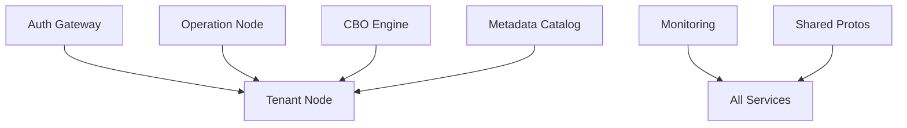

# Microservices Migration Guide

This document outlines the migration from monolithic to microservices architecture.

## Migration Status: ✅ COMPLETED

The codebase has been successfully restructured into microservices ready for independent deployment.

## New Architecture

### 🏗️ Service Structure

```
d:\python\storage_system\
├── auth-gateway/           # Authentication & API Gateway
├── operation-node/         # Tenant coordination & auto-scaling
├── tenant-node/           # Core data processing service
├── cbo-engine/            # Cost-based query optimizer
├── metadata-catalog/      # Metadata & compaction management
├── monitoring/            # Observability & metrics
├── shared-protos/         # Shared protocol definitions
└── docker-compose.yml     # Full system deployment
```

### 📦 Service Details

| Service | Port | gRPC Port | Description |
|---------|------|-----------|-------------|
| auth-gateway | 8080 | - | Authentication, authorization, API gateway |
| operation-node | 8081 | 50054 | Tenant coordination, auto-scaling |
| tenant-node | 8000 | 50051 | Data storage and processing |
| cbo-engine | 8082 | 50052 | Query optimization |
| metadata-catalog | 8083 | 50053 | Metadata management, compaction |
| monitoring | 8084 | - | Metrics, health monitoring |

### 🔄 Migration Summary

**Moved Components:**
- ✅ `query_optimizer.py` → `cbo-engine/`
- ✅ `auto_scaler.py` → `operation-node/`
- ✅ `metadata.py` → `metadata-catalog/`
- ✅ `compaction_manager.py` → `metadata-catalog/`
- ✅ All tenant node files → `tenant-node/`
- ✅ `storage.proto` → `shared-protos/`

**Created Services:**
- ✅ Auth Gateway (JWT, RBAC, rate limiting)
- ✅ Monitoring Service (Prometheus, health checks)
- ✅ Docker configurations for all services
- ✅ Docker Compose for full deployment

## 🚀 Deployment Options

### Option 1: Docker Compose (Recommended)
```bash
docker-compose up --build
```

### Option 2: Individual Services
```bash
cd tenant-node && python main.py
cd cbo-engine && python main.py
cd auth-gateway && python main.py
# ... etc
```

### Option 3: Kubernetes
Each service has a Dockerfile ready for K8s deployment.

## 🔧 Next Steps

### For Production Deployment:

1. **Environment Configuration**
   - Create environment-specific config files
   - Set up secrets management
   - Configure service discovery

2. **Database Setup**
   - Deploy PostgreSQL for metadata catalog
   - Set up Redis for caching
   - Configure backup strategies

3. **Monitoring Setup**
   - Deploy Prometheus + Grafana
   - Configure alerting rules
   - Set up log aggregation

4. **Security Hardening**
   - Generate proper JWT secrets
   - Set up TLS certificates
   - Configure firewall rules

5. **Repository Separation**
   - Each directory can become its own Git repository
   - Set up CI/CD pipelines for each service
   - Establish versioning strategy

## 📋 Service Dependencies



## 🔒 API Security

All services are protected by the Auth Gateway:
- JWT-based authentication
- Role-based access control
- Rate limiting
- Request validation

## 📊 Monitoring & Observability

- Health checks: `/health` on all services
- Metrics: Prometheus format on `/metrics`
- Logging: Structured JSON logs
- Tracing: Ready for distributed tracing

## 💾 Data Storage

- **Tenant Data**: Local file system or S3-compatible storage
- **Metadata**: PostgreSQL database
- **Metrics**: Prometheus TSDB
- **Logs**: Configurable (ELK, Loki, etc.)

---

**Status**: Ready for production deployment and repository separation!
